# 🌳🐍 Snake AI Using Decision Trees (XGBoost + DAgger)


<p align="center">
  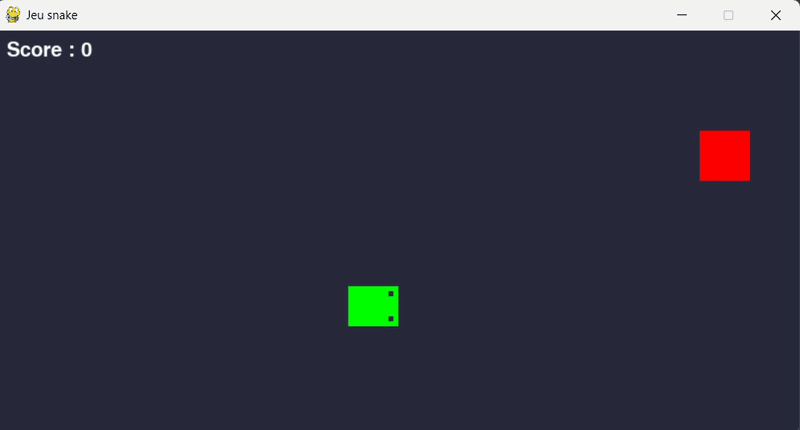
</p>

## 📝 Project Description

This project is a **continuation** of my Snake AI series :

- 🎮 The Snake game itself : [snake_game](https://github.com/Thibault-GAREL/snake_game)
- 🧬 First AI version using NEAT (NeuroEvolution) : [AI_snake_genetic_version](https://github.com/Thibault-GAREL/AI_snake_genetic_version)
- 🤖 Second AI version using Deep Q-Learning : [AI_snake_DQN_version](https://github.com/Thibault-GAREL/AI_snake_DQN_version)
- 🎯 Third AI version using PPO : [AI_snake_PPO_version](https://github.com/Thibault-GAREL/AI_snake_PPO_version)

This time, the agent learns to play Snake using **Imitation Learning** with **XGBoost** (boosted decision trees) and GPU/CUDA acceleration. Instead of reinforcement learning, the agent is first trained on demonstrations from a **greedy heuristic oracle**, then refined through **DAgger** (Dataset Aggregation) — mixing oracle and agent actions to iteratively correct distribution shift. 🌳🎯

The **oracle** is not a learned model — it is a hand-crafted algorithm with **perfect, instantaneous knowledge** of the game state. At every step, it computes the locally optimal move: always heading toward the food while avoiding walls and its own body. It never learns, never hesitates, and never makes mistakes by ignorance. Think of it as a **"God mode"** player — it sees everything and always knows the right answer.

**DAgger** solves a fundamental weakness of pure imitation learning : **distribution shift**. If the XGBoost model is only trained on oracle demonstrations, it learns to behave well in situations *the oracle encountered* — but the moment the trained agent starts playing on its own, it drifts into states the oracle never visited, and has no guidance. DAgger fixes this by letting the agent play partially autonomously, then asking the oracle *"what would you have done here?"* and adding those corrections to the training buffer. Over successive rounds, the agent covers more and more of its own failure states, making it progressively more robust.

The project also includes a full **Explainable AI (XAI)** suite to understand what the boosted tree ensemble has learned, with dedicated scripts mirroring the analysis done across all 4 Snake AI experiments.

---

## 🔬 Research Question

> **How do we extract complex reasoning from a neural network?**

Neural networks are often described as **black boxes**: their internal decision logic remains opaque despite producing relevant results. This project goes beyond training a performant agent — it applies **Explainable AI (XAI)** techniques to understand *why* the model makes the decisions it does.

The XGBoost Decision Tree is a unique case study: in theory a **white box** (a model whose logic is entirely human-readable, like a flowchart of if/then rules), it becomes a practical **grey box** once boosting produces tens of thousands of decision nodes. This tension between theoretical transparency and practical opacity is the central XAI question of this experiment.

---

## 🎯 Context & Motivation

The deeper motivation behind this project series is the **alignment problem** — one of the most important open challenges in AI. It refers to the difficulty of ensuring that AI systems act in accordance with human intentions, not just formal instructions.

Concrete failures: an agent tasked with "maximizing cleanliness" might throw away useful objects (emergent objectives), hide dirt under a rug (reward hacking), or block humans from entering to prevent re-dirtying. The agent does exactly what it was told — not what was intended.

This gap is hard to diagnose when you can't see inside the model. One key obstacle is the **black box problem**: deep neural networks make decisions through immense parameter spaces whose internal logic is effectively unreadable to humans. **Explainable AI (XAI)** is one answer — making AI reasoning transparent and interpretable.

This project uses Snake as the visual, intuitive testbed. The Decision Tree approach is particularly interesting for XAI: it was *designed* to be interpretable by construction, yet it reveals a fundamental paradox about the nature of transparency at scale.

---

## 🟩 Interpretability Spectrum

A key conceptual framework underlying the whole project series:

| Box type | Definition | Example |
| -------- | ---------- | ------- |
| ⬜ White box | Fully readable logic — policy extractable directly | Q-table (tabular Q-learning) |
| 🟨 Grey box | Transparent structure, unreadable complexity | **XGBoost (this project) — 80k–200k nodes** |
| ⬛ Black box | Opaque internals despite good performance | DQL, PPO |
| 🟩 NEAT | Small enough for manual inspection + XAI | NEAT (16 inputs, evolved topology) |

The **white box / grey box paradox** is the central finding of this experiment: an XGBoost model is theoretically a white box — decision trees are just if/then rules, readable by any human. But once boosting produces **80,000 to 200,000 decision nodes** across 1,600 trees, it exceeds human reading capacity entirely. The structure remains transparent; the complexity makes it unreadable in practice.

This makes XAI tools not just useful but *necessary* — even for a model designed to be interpretable.

---

## 🚀 Features

  🌳 **XGBoost** boosted decision trees with GPU/CUDA acceleration (`tree_method='hist'`)

  🧠 **Greedy oracle** bootstraps the dataset — no random exploration needed

  🔁 **DAgger-light** iterative refinement — beta-weighted mixing of oracle and agent actions

  📦 **Replay buffer** of up to 300k (state, action) pairs for supervised training

  🛡️ **sklearn fallback** — automatic switch to `GradientBoostingClassifier` if no GPU available

  💾 **Auto-save** of model and buffer after each training phase

  🔬 **Full XAI suite** — 4 independent analysis scripts

---

## ⚙️ How it works

  🎮 The AI controls a snake on a 10×14 grid. At each step, it receives a **state vector of 26 features** and predicts one of 4 actions (UP, RIGHT, DOWN, LEFT).

  🤖 **Phase 1 — Oracle** : the greedy oracle plays 500 games in "God mode" — it has full knowledge of the grid, always moves toward food, always avoids collisions. It fills the replay buffer with 300k (state, action) pairs that serve as ground-truth demonstrations.

  🧾 **Phase 2 — Initial training** : XGBoost is trained on the full oracle buffer using multi-class softmax. A 10% validation split with early stopping controls overfitting. At this stage the model can imitate the oracle, but only in situations the oracle encountered.

  🔁 **Phase 3 — DAgger** : 8 rounds of mixed-play to fix distribution shift. Each round, the agent plays autonomously with probability `1-beta` (exploring its own states) while the oracle plays with probability `beta`. Whenever the agent plays, the oracle silently labels every state with the correct action — only these oracle labels are stored. XGBoost is retrained on the growing buffer. Beta decays from 0.8 × 0.85^round (heavily oracle-guided at first) down to a 5% minimum (nearly autonomous). The agent progressively covers its own failure states, making it robust beyond pure imitation.

  📈 **Phase 4 — Evaluation** : pure agent-play over 100 games, no oracle. Final score distribution and mean/max reported.

---

## 🗺️ Model Architecture

```
Input (26)  →  XGBoost (400 estimators × 4 classes = 1 600 trees)
            →  Argmax
            →  Action (4)
```

<details>
<summary>📋 See all 26 features</summary>

### Distances to walls / body (8 inputs)

| # | Feature |
|---|---------|
| 0 | `distance_bord_N` — Distance to obstacle North |
| 1 | `distance_bord_NE` — Distance to obstacle North-East |
| 2 | `distance_bord_E` — Distance to obstacle East |
| 3 | `distance_bord_SE` — Distance to obstacle South-East |
| 4 | `distance_bord_S` — Distance to obstacle South |
| 5 | `distance_bord_SW` — Distance to obstacle South-West |
| 6 | `distance_bord_W` — Distance to obstacle West |
| 7 | `distance_bord_NW` — Distance to obstacle North-West |

### Distances to food (8 inputs)

| # | Feature |
|---|---------|
| 8  | `distance_food_N` — Distance to food North |
| 9  | `distance_food_NE` — Distance to food North-East |
| 10 | `distance_food_E` — Distance to food East |
| 11 | `distance_food_SE` — Distance to food South-East |
| 12 | `distance_food_S` — Distance to food South |
| 13 | `distance_food_SW` — Distance to food South-West |
| 14 | `distance_food_W` — Distance to food West |
| 15 | `distance_food_NW` — Distance to food North-West |

### Additional features (10 inputs)

| # | Feature |
|---|---------|
| 16 | `food_delta_x` — Normalized horizontal delta to food (+= food to the right) |
| 17 | `food_delta_y` — Normalized vertical delta to food (+= food below) |
| 18 | `danger_N` — Immediate danger binary (North) |
| 19 | `danger_E` — Immediate danger binary (East) |
| 20 | `danger_S` — Immediate danger binary (South) |
| 21 | `danger_W` — Immediate danger binary (West) |
| 22 | `dir_UP` — Current direction one-hot |
| 23 | `dir_RIGHT` — Current direction one-hot |
| 24 | `dir_DOWN` — Current direction one-hot |
| 25 | `dir_LEFT` — Current direction one-hot |

### Output — 4 actions

| # | Action |
|---|--------|
| 0 | `UP` |
| 1 | `RIGHT` |
| 2 | `DOWN` |
| 3 | `LEFT` |

</details>

---

## ⚙️ Key Hyperparameters

| Parameter | Value | Description |
|-----------|-------|-------------|
| `N_ORACLE_GAMES` | 500 | Games played by the greedy oracle |
| `N_DAGGER_ROUNDS` | 8 | DAgger refinement rounds |
| `DAGGER_BETA_INIT` | 0.8 | Initial oracle mixing ratio |
| `DAGGER_BETA_DECAY` | 0.85 | Beta decay per round |
| `n_estimators` | 400 | XGBoost boosting rounds |
| `max_depth` | 8 | Max depth per tree |
| `learning_rate` | 0.05 | XGBoost eta |

---

## 🆚 Comparison — 4 Snake AI approaches

This project is part of a series of **4 Snake AI implementations** using different AI paradigms on the same game :

| Aspect | 🧬 [NEAT](https://github.com/Thibault-GAREL/AI_snake_genetic_version) | 🌳 [Decision Tree](https://github.com/Thibault-GAREL/AI_snake_decision_tree_version) ★ | 🤖 [DQL (DQN)](https://github.com/Thibault-GAREL/AI_snake_DQN_version) | 🎯 [PPO](https://github.com/Thibault-GAREL/AI_snake_PPO_version) |
| --- | --- | --- | --- | --- |
| **Paradigm** | Evolutionary | Imitation Learning | Reinforcement Learning | Reinforcement Learning |
| **Algorithm type** | Neuroevolution | Supervised (XGBoost + DAgger) | Off-policy (Q-learning) | On-policy (Actor-Critic) |
| **Architecture** | 16 → ~28 hidden (final, evolved) → 4 | 26 → 1 600 trees (400×4) → 4 | 28 → 256 → 256 → 128 → 4 | 28 → 256 → 256 → {128→4 (π), 128→1 (V)} |
| **Model complexity** | ~200–500 params (evolves) | ~80k–200k decision nodes | ~140k params | ~145k params |
| **Exploration** | Genetic mutations + speciation | DAgger oracle (β : 0.8 → 0.05) | ε-greedy (1.0 → 0.01) | Entropy bonus (coef 0.05) |
| **Memory / Buffer** | Population (100 genomes) | Supervised buffer (300 000) | Experience Replay (100 000) | Rollout buffer (2 048 steps) |
| **Batch** | — (full population eval.) | Full dataset per round | 128 | 64 |
| **Training time** | **~15 h** | **~12 min (GPU)** | **~2.5 h (GPU)** | **~3 h (GPU)** |
| **Max score** | **> 20** | **43** | **45** | **64** |
| **Mean score** | **10** | **22.77** | **22.60** | **38.67** |
| **GPU support** | ❌ | ✅ | ✅ | ✅ |
| **Sample efficiency** | 🔴 Low | 🟢 High | 🟡 Medium | 🔴 Low |
| **Generalization** | 🟡 Medium | 🔴 Low | 🟡 Medium | 🟢 High |
| **Intrinsic interpretability** | 🟡 Low | 🟡 Medium (ensemble = grey box) | 🔴 Black box | 🔴 Black box |

> ★ = current repository
> Each project includes an XAI suite of 4 analysis scripts.

<details>
<summary>📅 Development timeline — Gantt chart</summary>


</details>

---

## 🔬 Explainable AI (XAI) Suite

Four dedicated scripts analyze the model, mirroring the XAI suite from the other Snake AI versions :

| Script | Analysis | Output |
|--------|----------|--------|
| `xai_dt_predictions.py` | Probability heatmaps, confidence map, temporal evolution | `xai_dt_predictions/` |
| `xai_dt_features.py` | Permutation importance, native XGBoost importance, feature-action correlation | `xai_dt_features/` |
| `xai_dt_internals.py` | Importance distributions, tree specialization, t-SNE / UMAP | `xai_dt_internals/` |
| `xai_dt_shap.py` | SHAP TreeExplainer — beeswarm, waterfall, force plots, summary heatmap | `xai_dt_shap/` |

**Key findings from XAI analysis (baseline score: 22.9 apples) :**

- 🏆 **ΔFood Y** is the dominant feature — score drop of −22.4 on removal, it drives decisions more than absolute food position
- ⚠️ **Danger E and Danger W** are second and third (−16.8 and −16.15) — unlike NEAT, binary danger signals play a central role
- 🔄 **Feature engineering enriched the policy** : adding `danger_*`, `food_delta_*` and `dir_*` directly led to a more reactive, contextual strategy — NEAT had none of these
- 🔁 **More adaptive than NEAT** : the snake changes direction much more frequently, probabilities oscillate rapidly between actions based on immediate context rather than following a fixed circular pattern
- 🟨 **Grey box confirmed** : 80k–200k nodes — XGBoost native metrics (Gain, Weight, Cover) are the only practical way to understand the model's internal structure

<details>
<summary>📸 Predictions analysis — xai_dt_predictions.py</summary>

Shows **what the model "thinks"** at each cell of the grid. The probability heatmaps reveal which action the model favors per position (food fixed), the confidence map shows where the model is uncertain vs. decisive, and the temporal evolution tracks how action probabilities shift step by step during a real episode — including the moment of death.

#### Probability heatmaps
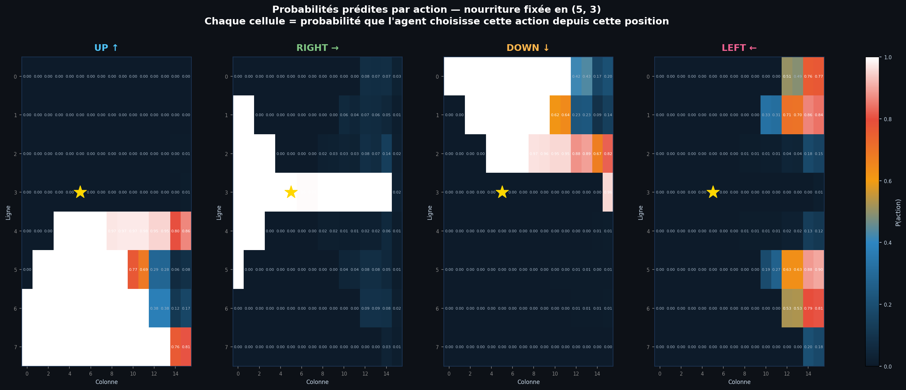

#### Confidence map & learned policy
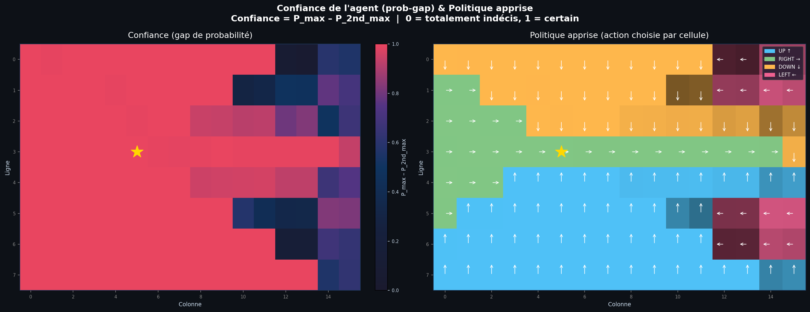

#### Temporal probability evolution
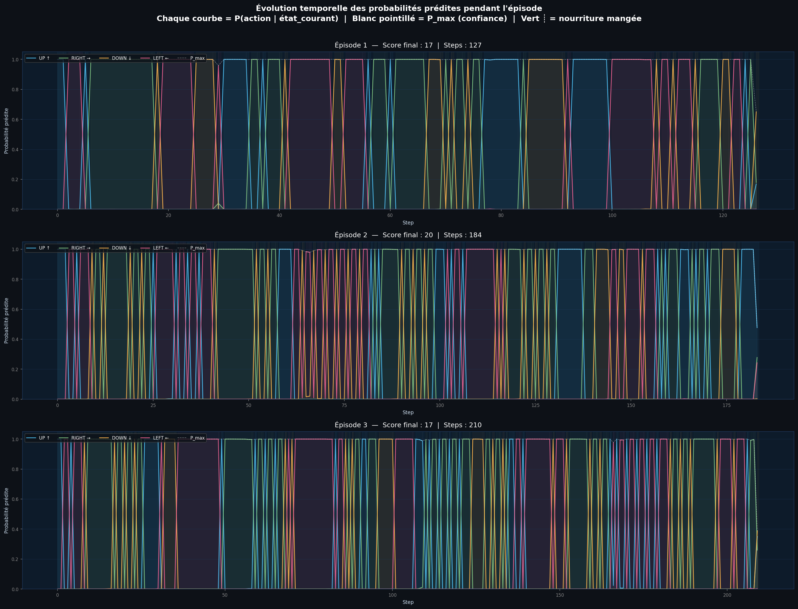

</details>

<details>
<summary>📸 Feature importance — xai_dt_features.py</summary>

Answers the question : **which features actually matter?** Permutation importance measures the score drop when each feature is shuffled. Native XGBoost importance (gain / weight / cover) reveals which features are most used at split time. The correlation heatmap and sensory profiles show which feature tends to trigger which action.

Key finding : **ΔFood Y dominates**, followed by binary danger signals East and West. The feature engineering (danger, delta food, direction) directly shapes a richer strategy than NEAT's food-distance-only inputs.

#### Permutation importance
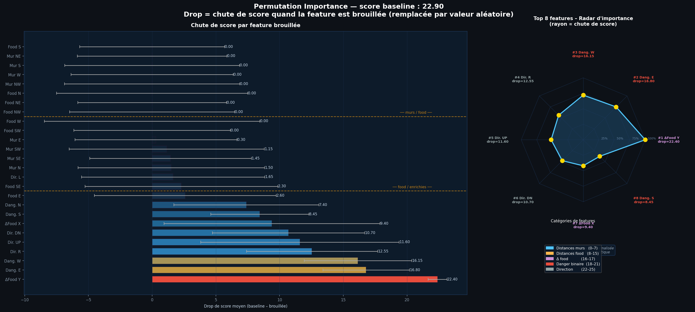

#### Native XGBoost importance (gain / weight / cover)
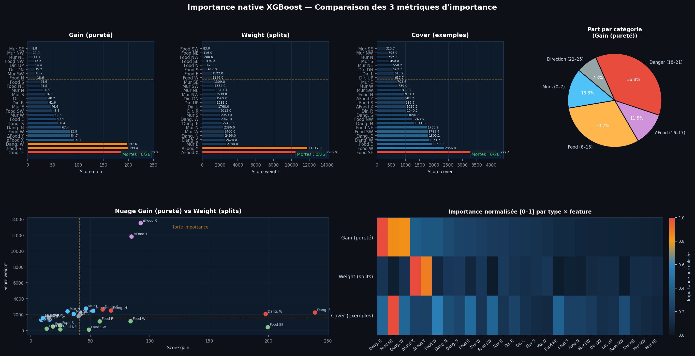

#### Feature-action correlation
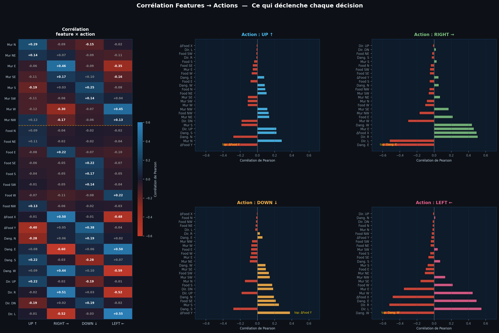

#### Sensory profile per action


</details>

<details>
<summary>📸 Tree internals — xai_dt_internals.py</summary>

Looks inside the ensemble itself. The importance distributions expose **dead features** (never used in any split — analogue of dead neurons). The specialization plot identifies which features drive decisions in specific game situations (danger, food aligned…). The t-SNE and UMAP projections map the 26-dimensional game states into 2D to reveal clusters of similar situations — more structured than NEAT, coherent with a more nuanced policy.

#### Importance distributions (dead features)
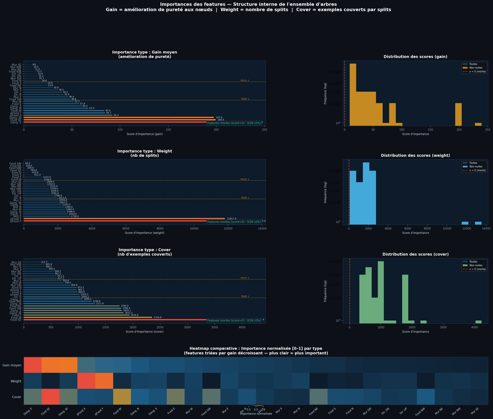

#### Feature specialization by game situation
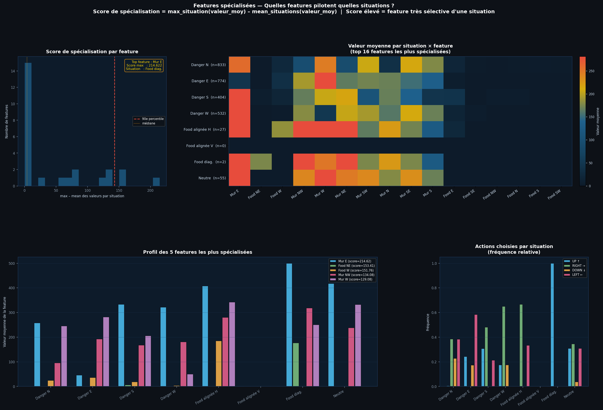

#### t-SNE projection of game states
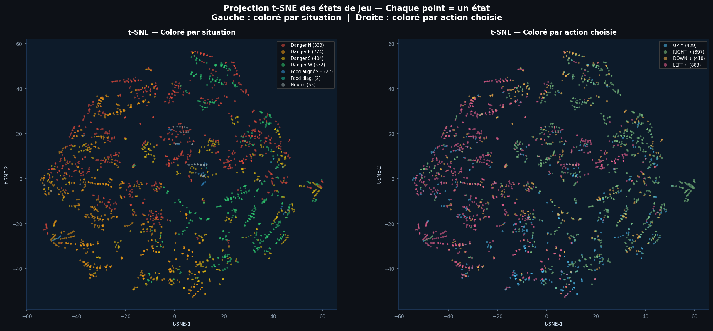

#### UMAP projection
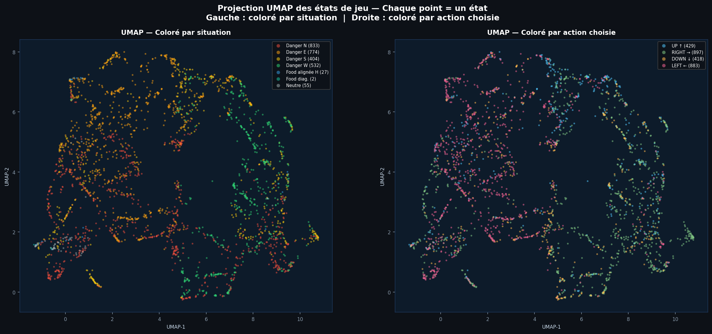

</details>

<details>
<summary>📸 SHAP analysis — xai_dt_shap.py</summary>

Uses **SHAP TreeExplainer** (native to XGBoost — much faster than DeepExplainer) to decompose every prediction into per-feature contributions. The beeswarm gives a global ranking of feature impact across all decisions. The waterfall plots break down one specific decision per game situation. The summary heatmap shows signed SHAP values per feature × action, revealing which features push the model toward or away from each action.

#### Beeswarm plot
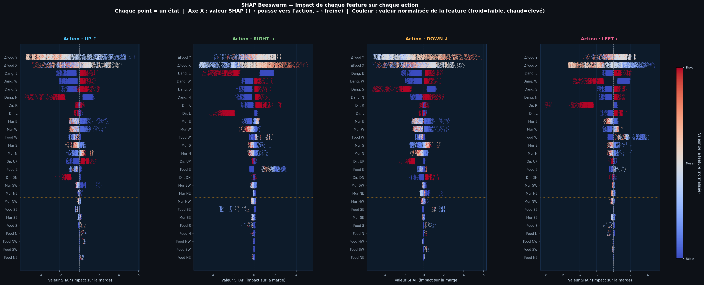

#### Waterfall plots (per game situation)
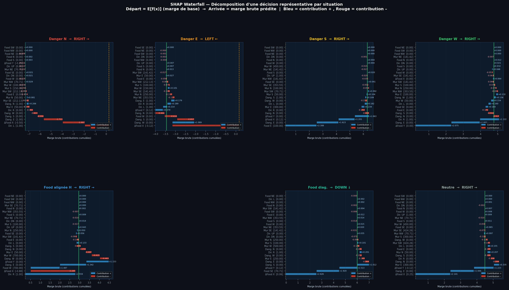

#### SHAP summary heatmap
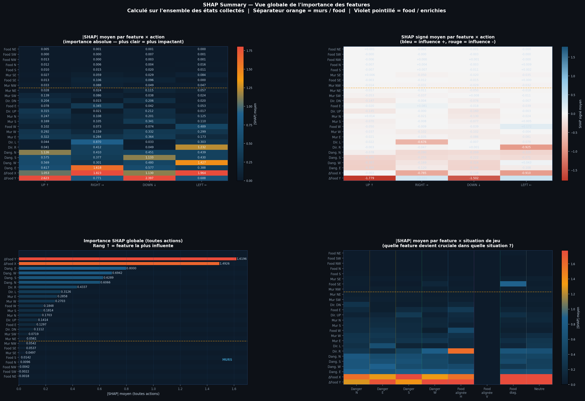

</details>

---

## 💡 Key Insights

**The white box / grey box paradox**
XGBoost was chosen precisely because it is interpretable — but 80k–200k nodes make it a practical grey box. Where NEAT allowed direct graph reading, the XGBoost ensemble requires XAI tools just to understand what should have been straightforward. **Interpretability is not just about architecture; it depends on whether a human can actually process the complexity.**

**Feature engineering directly shapes the learned strategy**
Adding `danger_*`, `food_delta_*` and `dir_*` to the 16 NEAT inputs (26 total) changed the strategy qualitatively — not just quantitatively:

- NEAT's strategy: food-first, circular movement, fixed pattern
- DT's strategy: danger-reactive, directionally aware, adapts based on game context and snake length

The features you give a model fundamentally define what it can learn.

**DAgger solves distribution shift**
Pure imitation from oracle demonstrations fails: the trained model drifts into states the oracle never visited. DAgger's insight — let the agent explore, then ask the oracle "what would you have done here?" — progressively covers failure states and produces a robust policy in just ~12 minutes of GPU training.

**XAI is closer to data science than AI**
The analysis tools (SHAP, permutation importance, native XGBoost metrics) are essentially structured information extraction and visualization — not algorithms trained to understand networks. The work of an XAI practitioner here looks more like a data scientist making insights accessible than an ML researcher training models.

### Learned strategy comparison across the 4 experiments

| Agent | Strategy type | Most influential feature |
| ----- | ------------- | ------------------------ |
| NEAT | Circular, food-chasing, fixed | `food_N` (food distance North) |
| **Decision Tree** | Reactive, danger-aware, adaptive | `ΔFood Y` + `Danger E/W` |
| DQL | Size-aware, body-anticipating | `Length` + `ΔFood X/Y` |
| PPO | Symmetric risk, end-game anticipation | `Danger binary` (all directions) |

---

## 🔭 Perspectives

  🗺️ **Saliency Maps** — the natural next step: apply XAI to image recognition models, highlighting the exact pixels that triggered a decision (e.g., a cat's ears to classify it as a cat).

  🤖 **Automated XAI** — move from human-driven data science analysis to an AI that automatically analyzes any model and produces a readable strategy summary. Current tools are fast but shallow; an intelligent XAI system could reveal complex multi-feature interactions that no human would manually uncover.

  🗄️ **Neural network analysis database** — build a dataset of diverse trained agents, then train an AI to generalize: input a model, output its strategy in human-readable form.

  🔧 **Optimization via XAI** — dead features identified from importance scores could directly guide model pruning: fewer trees, same performance, lower compute cost and ecological footprint.

---

## 📂 Repository structure

```bash
├── img/                            # For the README
│   └── Snake_arbre_de_decision-Score_31.gif
│
├── snake.py                        # Snake game (from snake_game repo)
├── arbre_de_decision.py            # XGBoost agent, oracle, replay buffer, DAgger
├── main.py                         # Training pipeline (4 phases)
│
├── xai_dt_predictions.py           # XAI — Probability heatmaps & temporal analysis
├── xai_dt_features.py              # XAI — Feature importance
├── xai_dt_internals.py             # XAI — Tree structure & state projections
├── xai_dt_shap.py                  # XAI — SHAP explanations
│
├── snake_xgb_model.pkl             # Trained model checkpoint (auto-saved)
├── snake_replay_buffer.pkl         # Replay buffer (auto-saved)
├── snake_training_curves.png       # Training curves (auto-generated)
│
├── xai_dt_predictions/             # Output plots — Predictions
├── xai_dt_features/                # Output plots — Feature importance
├── xai_dt_internals/               # Output plots — Tree internals
├── xai_dt_shap/                    # Output plots + HTML — SHAP
│
├── Rapport MPP - Thibault GAREL - 2026-04-13.pdf   # Full analysis report
├── LICENSE
└── README.md
```

---

## 💻 Run it on Your PC

Clone the repository and install dependencies :

```bash
git clone https://github.com/Thibault-GAREL/AI_snake_decision_tree_version.git
cd AI_snake_decision_tree_version

python -m venv .venv # if you don't have a virtual environment
source .venv/bin/activate   # Linux / macOS
.venv\Scripts\activate      # Windows

pip install pygame numpy matplotlib scipy scikit-learn
pip install xgboost           # GPU support via CUDA if available
pip install shap              # for xai_dt_shap.py
pip install umap-learn        # optional, for xai_dt_internals.py --umap
```

⚠️ XGBoost will automatically fall back to **CPU mode** if no CUDA-compatible GPU is detected — no manual change needed.

### Train the agent

```bash
python main.py              # full pipeline (oracle → train → DAgger → eval)
python main.py demo         # load saved model and play visually (5 games)
python main.py demo 10      # idem, 10 games
```

### Run XAI analyses

```bash
python xai_dt_predictions.py              # all prediction plots
python xai_dt_features.py                 # all feature importance plots
python xai_dt_internals.py --tsne         # t-SNE projection
python xai_dt_internals.py --umap         # UMAP projection
python xai_dt_shap.py                     # all SHAP plots
python xai_dt_shap.py --beeswarm          # SHAP beeswarm only
```

---

## 📑 Full Report

A detailed report accompanies this project series, covering the full analysis : training methodology, manual interpretability, XAI results, and comparison across all 4 Snake AI approaches (NEAT, Decision Tree, DQL, PPO).

📥 [Download the report (PDF)](Rapport%20MPP%20-%20Thibault%20GAREL%20-%202026-04-13.pdf)

---

## 📖 Sources & Research Papers

- **NEAT algorithm** — [*Evolving Neural Networks through Augmenting Topologies*](http://nn.cs.utexas.edu/downloads/papers/stanley.ec02.pdf), Stanley & Miikkulainen (2002)
- **XGBoost** — [*A Scalable Tree Boosting System*](https://arxiv.org/abs/1603.02754), Tianqi Chen (2016)
- **DAgger** — [*A Reduction of Imitation Learning and Structured Prediction to No-Regret Online Learning*](https://arxiv.org/abs/1011.0686), Ross et al. (2011)
- **Deep Q-Learning** — [*A Theoretical Analysis of Deep Q-Learning*](https://arxiv.org/abs/1901.00137), Zhuoran Yang (2019)
- **PPO** — [*Proximal Policy Optimization Algorithms*](https://arxiv.org/abs/1707.06347), John Schulman (2017)
- **XAI Survey** — [*Explainable AI: A Survey of Needs, Techniques, Applications, and Future Direction*](https://arxiv.org/abs/2409.00265), Mersha et al. (2024)
- *L'Intelligence Artificielle pour les développeurs* — Virginie Mathivet (2014)

Code created by me 😎, Thibault GAREL — [Github](https://github.com/Thibault-GAREL)
